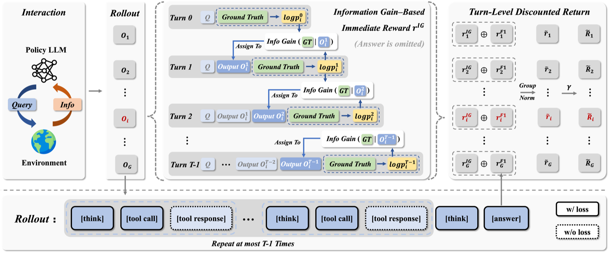
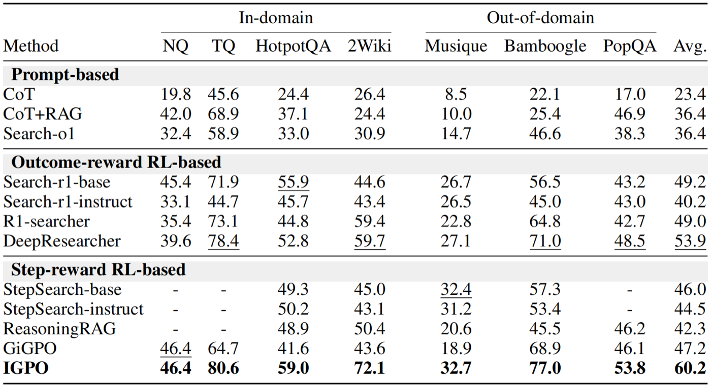

## Information Gain–based Policy Optimization (IGPO)

Implementation of the agentic RL framework proposed in **[Information Gain-based Policy Optimization: A Simple and Effective Approach for Multi-Turn Search Agents](https://arxiv.org/abs/2510.14967)** (Wang et al., ICLR 2026).

This repository is a **lightweight, single-GPU / Colab reproduction** of the core algorithm (Eq. 3–8): turn-level *information gain* process rewards under a GRPO-style clipped surrogate, for multi-turn search agents.

Official full-scale training stack (veRL / multi-node): [GuoqingWang1/IGPO](https://github.com/GuoqingWang1/IGPO)

[](https://arxiv.org/abs/2510.14967)
[](https://colab.research.google.com/github/ankknaiii/igpo-agentic-search/blob/main/notebooks/train_igpo_colab.ipynb)
[](LICENSE)

---

<p align="center">
  
</p>
<p align="center"><em>Figure 1. Official IGPO training pipeline (from the paper / official repo): turn-level information-gain rewards + outcome F1 → discounted turn advantages → GRPO-style update. Tool responses are masked from the loss.</em></p>

<p align="center">
  
</p>
<p align="center"><em>Figure 2. Official reported results (ICLR 2026): IGPO vs prompt / outcome-RL / step-RL baselines across in-domain and OOD search QA benchmarks.</em></p>

---

## Why this exists

Outcome-only GRPO assigns **one scalar reward per rollout**. With small group sizes:

| Regime | Within-group outcomes | Group-relative advantage |
|--------|----------------------|---------------------------|
| Easy queries | all correct | **collapse → 0** |
| Hard queries | all incorrect | **collapse → 0** |

Zero advantage ⇒ no policy gradient. Multi-turn search also lacks credit assignment across tool-use turns.

IGPO’s claim is simple and strong: treat each search turn as incremental information acquisition about the ground truth; reward the **adjacent-turn change** in teacher-forced \(P(\text{GT}\mid\text{context})\). The signal is intrinsic, GT-aware, cheap (no MCTS / external RM), and remains informative when outcomes collapse.

---

## Method (aligned with the paper)

Teacher-forced geometric-mean probability of the ground-truth answer:

```text
π_θ(a | q, o_≤t) = exp( (1/L) Σ_j log π_θ(a_j | q, o_≤t, a_<j) )
```

Turn-level information gain (default `prob_diff`) and final outcome reward:

```text
r_t = π_θ(a | q, o_≤t) - π_θ(a | q, o_≤t-1) ,   1 ≤ t < T
r_T = F1(â, a)   # or format penalty
```

Group z-normalization (`separate` or `joint`), then discounted turn advantages:

```text
Ã_t = Σ_{k=t}^{T} γ^{k-t} A_k
```

Optimize with a GRPO-style clipped surrogate using turn-broadcast advantages (Eq. 8). Sampling token ids are retained **without** decode→encode round-trips so importance ratios remain valid. Default `ppo_epochs=4` so clipping is not vacuous.

`gamma` controls temporal credit; default `0.95`. At `gamma=1.0`, advantages reduce to undiscounted sums of future normalized rewards.

---

## Stack / frameworks used

| Layer | Choice | Role in this repo |
|-------|--------|-------------------|
| Policy optimization | **GRPO / IGPO** (DeepSeekMath lineage + Wang et al. 2026) | Group-relative advantages; turn-level IG rewards |
| Surrogate | **PPO clip** (Schulman et al. 2017) | Multi-epoch updates with `clip_eps` |
| Base model | **Qwen2.5-Instruct** (0.5B default; 1.5B/3B optional) | Actor / sampling / teacher forcing |
| Adaptation | **LoRA (PEFT)** | Trainable adapters on T4-class GPUs |
| Model hub | **ModelScope → Hugging Face** | Dual-source load (`model_source=auto`) |
| Agent loop | Multi-turn `<think>` / `<tool_call>` / `<answer>` | Search-agent trajectory format (DeepResearcher-style) |
| Retrieval | Offline corpus (+ optional noise) | Deterministic mock KB (no Serper required) |
| Eval | Held-out JSONL + greedy decode | F1 / EM / collapse / mean \|IG\| |

Official paper experiments use **veRL + live web search + Qwen2.5-7B** on 8×A100. This repo keeps the **same objective**, on a stack you can actually run and ablate on Colab.

```text
Query ──► Rollout (G samples) ──► IG_t (teacher force GT) + F1_T
                │
                ▼
      group z-norm (separate IG / F1)
                │
                ▼
      Ã_t = discounted turn advantages
                │
                ▼
      PPO/GRPO clip  ×  ppo_epochs   (tool tokens masked)
```

---

## Install

```bash
git clone https://github.com/ankknaiii/igpo-agentic-search.git
cd igpo-agentic-search
pip install -e ".[dev]"
```

Integrity checks (no GPU required):

```bash
python scripts/integrity_check.py
pytest -q
```

---

## One-click Colab

1. Open: [](https://colab.research.google.com/github/ankknaiii/igpo-agentic-search/blob/main/notebooks/train_igpo_colab.ipynb)
2. Runtime → **T4 GPU**
3. Runtime → **Run all**

The pipeline cell will: sync `main` → fix Colab `torchao` conflicts → install → unit tests → short IGPO train → plot curves.

---

## Usage

```python
from igpo.train.trainer import TrainConfig, run_training

cfg = TrainConfig(
    model_name="Qwen/Qwen2.5-0.5B-Instruct",
    model_source="auto",      # ModelScope first, Hugging Face fallback
    algo="igpo",              # or "grpo" for outcome-only baseline
    max_steps=50,
    prompts_per_step=4,
    group_size=8,
    ppo_epochs=4,
    gamma=0.95,
    info_gain_type="prob_diff",
    info_gain_norm_mode="separate",
    output_dir="./outputs/igpo",
    eval_every=10,
)

history = run_training(cfg)
```

Ablation (same hparams, multiple seeds):

```bash
python scripts/run_ablation.py --algo igpo --seed 1 --seed 2 --seed 3 --max_steps 50
python scripts/run_ablation.py --algo grpo --seed 1 --seed 2 --seed 3 --max_steps 50
python scripts/analyze_ablation.py --input_dir ./ablation_results --metric collapse_rate
```

---

## Repository layout

```text
igpo/
  rewards/       outcome F1 (SQuAD-style) + information-gain process reward
  advantage/     group normalization + discounted turn advantages
  algo/          clipped surrogate + unbiased KL estimate
  env/           offline retrieval corpus
  agent/         multi-turn rollout (raw sampled token ids retained)
  train/         LoRA trainer (PPO epochs, warmup, checkpointing)
  eval/          held-out greedy evaluator
  data/          qa_offline.jsonl (200) · qa_eval.jsonl (50)
notebooks/train_igpo_colab.ipynb
scripts/integrity_check.py
scripts/run_ablation.py
scripts/analyze_ablation.py
assets/          paper figures (framework / results)
```

---

## Config surface

| Field | Default | Meaning |
|-------|---------|---------|
| `algo` | `igpo` | `igpo` or `grpo` |
| `model_source` | `auto` | `modelscope` / `huggingface` / `auto` |
| `max_steps` | `500` | outer optimization steps |
| `group_size` | `8` | rollouts per prompt (GRPO group) |
| `ppo_epochs` | `4` | inner surrogate epochs per batch |
| `gamma` | `0.95` | turn-advantage discount |
| `clip_eps` | `0.2` | PPO clip |
| `kl_coef` | `0.001` | KL to frozen base (LoRA-off) |
| `info_gain_type` | `prob_diff` | or `log_prob_diff` |
| `info_gain_norm_mode` | `separate` | or `joint` |
| `eval_every` | `50` | held-out eval cadence |

Logged metrics: `mean_f1`, `collapse_rate`, `mean_abs_ig`, `mean_ratio`, `clipfrac`.

On step 1 / epoch 0 the trainer prints `mean_ratio` (importance sampling sanity check; should be ≈ 1.0 before the first update accumulates).

---

## Scope vs official release

| | This repo | Official IGPO |
|--|-----------|---------------|
| Compute | Colab T4 / single GPU | 8×A100 |
| Framework | lightweight trainer | veRL + Ray |
| Retrieval | offline corpus + noise | live web search API |
| Model | 0.5B–3B + LoRA | Qwen2.5-7B |
| Objective | Eq. 3–8 | full system + curriculum options |

**Known limits.** Offline retrieval is not open-web. 0.5B+LoRA is for algorithm verification, not paper-number matching. IG rewards require ground-truth answers (not open-ended unsupervised settings).

---

## Todo

- [x] Preserve sampled token ids (no decode→encode) for valid IS ratios
- [x] PPO multi-epoch loop + unbiased KL
- [x] Turn-correct outcome reward; SQuAD Counter F1
- [x] Offline corpus ≥50 docs; train/eval split 200/50
- [x] ModelScope → HF dual-source load
- [x] One-click Colab (`Runtime → Run all`)
- [ ] Optional Serper/Bing tool server parity with official repo
- [ ] Larger-scale ablations (3B+, more seeds) and published metric tables

---

## Citation

```bibtex
@inproceedings{wang2026information,
  title={Information Gain-based Policy Optimization: A Simple and Effective Approach for Multi-Turn Search Agents},
  author={Guoqing Wang and Sunhao Dai and Guangze Ye and Zeyu Gan and Wei Yao and Yong Deng and Xiaofeng Wu and Zhenzhe Ying},
  booktitle={ICLR},
  year={2026},
  url={https://arxiv.org/abs/2510.14967}
}
```

```bibtex
@article{shao2024deepseekmath,
  title={DeepSeekMath: Pushing the Limits of Mathematical Reasoning in Open Language Models},
  author={Shao, Zhihong and others},
  journal={arXiv preprint arXiv:2402.03300},
  year={2024}
}
```

```bibtex
@article{schulman2017ppo,
  title={Proximal Policy Optimization Algorithms},
  author={Schulman, John and Wolski, Filip and Dhariwal, Prafulla and Radford, Alec and Klimov, Oleg},
  journal={arXiv preprint arXiv:1707.06347},
  year={2017}
}
```
