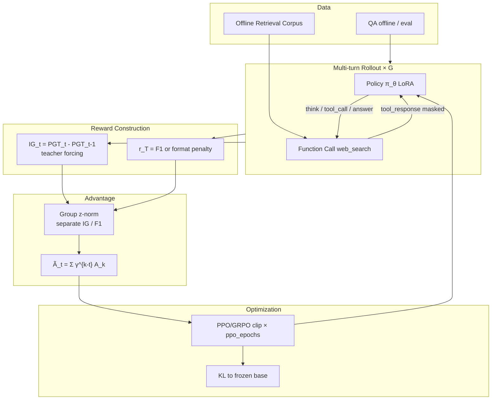
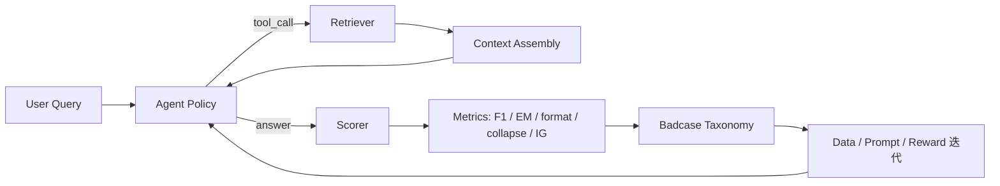

# IGPO 项目复盘 × Seedream 效果岗面试题库

> 用途：一面 / 二面口述底稿。  
> 岗位锚点：Seedream 图像大模型效果建设（理想态 / 标准 / 评测 / 数据闭环 / 迭代策略）。  
> 项目锚点：IGPO 多轮 Search Agent RL（信息增益过程奖励 + GRPO）。  
> 原则：**先讲效果问题与闭环，再讲算法细节**；把 Agent/RAG 问题映射到「效果标准—评测—数据—迭代」。

仓库：https://github.com/ankknaiii/igpo-agentic-search  
论文：Wang et al., ICLR 2026, [arXiv:2510.14967](https://arxiv.org/abs/2510.14967)

---

## 0. 30 秒项目电梯稿（先背这段）

我做的是 **多轮 Search Agent 的 Post-train 效果建设**：在 GRPO 框架上引入 **Information Gain 过程奖励（IGPO）**，解决小 group 下「全对 / 全错 → advantage=0 → 无梯度」的效果塌缩，以及多轮 tool-use 的信用分配缺失。

闭环是：

1. **理想态**：每轮检索应提升模型对正确答案的信念；终局答案应对齐 GT（F1）。  
2. **标准 / 评测**：outcome F1·EM、collapse rate、mean |IG|、held-out 贪心评估。  
3. **数据**：离线多跳 QA + 检索语料；格式合法轨迹 / badcase 回流。  
4. **迭代**：对照 GRPO vs IGPO；调 γ、norm、ppo_epochs、检索噪声；修 IS / credit assignment 等实现缺陷。

这和 Seedream 岗的「理想态定义 → 标准与评测 → 数据闭环 → 指导算法迭代」是同一套方法论，只是模态从图像换成了 agentic search。

---

## 1. 工程复盘：出现过的问题 → 根因 → 解决思路

| # | 现象 | 根因 | 解决思路 | 面试可升华的点 |
|---|------|------|----------|----------------|
| 1 | Colab 一开就 `FileNotFoundError` | GitHub→Colab 只带 ipynb，未 clone 完整仓库；`REPO_URL` 默认为空 | Bootstrap 默认 clone；一键 Run all 强制 `git fetch + reset --hard origin/main` | **效果实验可复现基础设施**必须先于算法 |
| 2 | `peft` 报 `torchao 0.10.0` 不兼容 | Colab 预装旧 torchao；新 peft 硬性检查版本 | 项目不依赖 torchao → 安装前后卸载；trainer 内 lazy import peft 前再清理 | 环境漂移会伪装成「模型训不动」 |
| 3 | `KeyError: 'name'` | System prompt 里 JSON `{}` 被 `str.format` 当占位符 | 改为 `string.Template`（`$today`） | Prompt/schema 属于**效果标准的一部分** |
| 4 | 训练 ratio 失去意义 / 更新无效 | `generate` 后 decode→encode，token 序列漂移，IS ratio 失效 | **直接保存 `generate` 的 token ids**，禁止往返 | RLHF「第一性原则」：采样轨迹必须可复算 |
| 5 | `clip_eps` 形同虚设 | 每 batch 只 1 次更新 → 退化为 REINFORCE | `ppo_epochs=4` 内循环 | 样本效率与 surrogate 有效性 |
| 6 | 大量 -2.0 格式惩罚 | outcome 打在 `turns[-1]`，可能是 tool_response | 取 **最后一轮 assistant** 文本计分 | **评测必须打在正确动作对象上** |
| 7 | IG=0 被改成 `1e-10` | 人为扰动破坏 z-norm | 删除 hack；零 IG 是合法信号 | 指标工程禁忌：为绕过检查污染分布 |
| 8 | F1 与论文不一致 | `set` 丢词频 | SQuAD `Counter` F1 | **标准定义必须可复现、可对齐文献** |
| 9 | γ=1 信用分配扁平 | 无衰减 → 各 turn advantage 趋同 | 默认 `γ=0.95` | 过程奖励需要时间结构 |
| 10 | 小模型不按格式输出 | 无 few-shot / schema 约束弱 | Prompt 加 example；格式惩罚；评测 temperature=0 | 效果建设里「格式遵循」是硬门槛 |
| 11 | 数据/检索过弱 | 12 条 QA、十几篇文档 | 200/50 划分 + ≥50 文档 + 检索噪声 | 没有 held-out 的涨点不可信 |
| 12 | GitHub 大图 push 失败 | 资源图过大 | 压缩后入库 | 交付链路也是工程能力 |

### 复盘结论（可直接说）

效果建设的失败模式往往不是「loss 公式写错一个符号」这么简单，而是：

1. **标准打在错误对象上**（tool vs assistant）  
2. **指标被工程 hack 污染**（1e-10）  
3. **优化目标与采样轨迹不一致**（token 往返）  
4. **实验不可复现**（环境 / 数据 / seed）  

这些在 Seedream 侧对应：错标美学维度、用 shortcut 刷榜、标注与线上分布不一致、评测集泄漏。

---

## 2. 系统架构图（一面必画）

### 2.1 训练期架构



### 2.2 推理期 / 效果评测架构



### 2.3 口述要点（画完图补三句）

1. **决策 token**（think / tool_call / answer）进梯度；**tool_response** 掩码。  
2. **过程奖励**看信念是否上升；**结果奖励**看终局是否对。  
3. **评测与训练同 schema**，否则优化的是另一套行为。

---

## 3. 项目输入 / 输出（高频）

| | 训练 | 推理 / 评测 |
|--|------|-------------|
| **输入** | `(question, ground_truth)`；离线语料库；`TrainConfig` | `question`；检索语料；greedy/sampling 配置 |
| **中间态** | 多轮轨迹；每轮 `P(GT\|ctx)`；IG 序列；F1 | think / tool_call / tool_response / answer |
| **输出** | LoRA adapter；`metrics.jsonl`；`eval_metrics.jsonl`；曲线 | 最终 `<answer>`；可选检索轨迹 |
| **成功判据** | collapse↓、held-out F1↑、mean\|IG\|有结构、ratio≈1（首步） | 格式合法 + 答案正确 + 检索轮次合理 |

一句话：

> 输入是「带标准答案的多跳问题 + 可检索知识」；输出是「可调用工具的策略（LoRA）+ 可解释的效果指标与 badcase」。

---

## 4. Function Call 怎么设计的？

### 4.1 Schema（与效果标准绑定）

两种合法动作（互斥）：

```text
<think>...</think>
<tool_call>{"name":"web_search","arguments":{"query":"..."}}</tool_call>

或

<think>...</think>
<answer>...</answer>
```

设计原则：

1. **单一出口**：每轮只能 tool 或 answer，避免「又搜又答」的模糊动作。  
2. **可解析**：JSON 参数 + 正则/JSON 双解析；兼容 `<search>q</search>`。  
3. **可评分**：格式不合法 → 固定惩罚（-2），与正确性解耦。  
4. **可掩码**：环境返回包在 `<tool_response>`，不进 loss。

### 4.2 映射到 Seedream 岗

Function call ≈ **模型可执行的编辑/生成原语**（改光、换装、保持身份…）。你要强调的是：

- 先定义 **合法动作空间** 与 **违规代价**  
- 再定义 **成功标准**（保持 / 美感 / 遵循）  
- 评测必须打在「模型动作」而非「环境噪声」上

---

## 5. 面试高频题：标准答法（Agent / RAG → 效果岗语言）

### Q1. 多 Agent 决策冲突（一个说能发货，一个说不能）

**本项目映射**：多轮 / 多信号冲突 = outcome 说「最终错了」但中间某轮 IG 为正。

**答法结构**：

1. **分层决策权**：定义权威源（库存系统 > 客服话术模型；GT/规则 > 风格偏好）。  
2. **冲突类型分类**：事实冲突 / 策略冲突 / 信息不足。  
3. **仲裁策略**：  
   - 事实：查权威工具，禁止模型臆断  
   - 策略：按业务优先级表（安全 > 合规 > 体验）  
   - 不足：升级澄清，而不是随机选边  
4. **记录与评测**：冲突率、仲裁正确率、用户伤害 case。

一句话金句：

> 冲突不是靠「再开一个 agent 投票」解决的，而是靠 **权威层级 + 可验证工具 + 明确升级路径**。

### Q2. 长期记忆 / 短期记忆如何设计？

| 类型 | 内容 | 存储 | 查询 |
|------|------|------|------|
| 短期 | 当前多轮对话、本 episode 检索片段 | 上下文窗口 / 会话状态（结构化） | 最近 K 轮 + 关键 tool 结果 |
| 长期 | 用户偏好、历史成功策略、稳定事实 | 向量库（语义）+ 关系库/KV（精确事实） | 先精确键查，再向量召回，再重排 |

**本项目**：短期 = 当前 rollout messages；长期（扩展）= 成功 query 模板 / badcase 标签库。

**最优查询**：

1. 路由：事实型 → SQL/KV；相似经验 → vector  
2. 过滤：时间 / 用户 / 权限  
3. 重排：与当前 query 相关性 + 可靠性分  
4. 写入：只写「验证过」的记忆，防污染

### Q3. RAG 文档怎么切？如何避免语义断裂？

本项目用的是 **文档级离线语料**（短文档），扩展答法：

1. **结构优先**：按标题/段落/列表切，而非固定 512 token 一刀切。  
2. **语义滑窗**：chunk 重叠 10–20%。  
3. **原子性**：一个 chunk 尽量承载一个可独立回答的命题。  
4. **元数据**：标题路径、实体、来源，便于过滤。  
5. **断裂检测**：问答时若证据跨 chunk，做 parent-doc / small-to-big 召回。

### Q4. 多路召回怎么做？

本项目：关键词重叠检索 + 可选噪声文档。扩展工业答法：

| 路 | 作用 |
|----|------|
| 向量检索 | 语义相似 |
| BM25 / 稀疏 | 专有名词、精确匹配 |
| 结构化 / Graph | 多跳实体关系 |
| 规则 / 词典 | 强约束业务字段 |

融合：RRF / 学习排序；再 cross-encoder 重排。

### Q5. 检索对了模型仍不答检索内容（幻觉）——怎么办？

分层治理（强烈建议按这个顺序讲）：

1. **约束解码 / 强制引用**：答案必须指向证据 span。  
2. **拒答机制**：证据不足 → 「无法确认」而不是编造。  
3. **过程监督**：奖励「使用证据」的行为（类比本项目的 IG：信念应随证据上升）。  
4. **对比训练**：有证据答错 vs 按证据答对 的偏好对。  
5. **评测**：faithfulness / citation precision，不只看答案对错。

映射 Seedream：明明参考图要求「保持人脸」，模型仍大改——要用 **保持维度专项指标 + 过程约束 + badcase 数据** 压，而不是只看「好不好看」。

### Q6. 如何量化 RAG / Agent 效果？

| 层级 | 指标 |
|------|------|
| 检索 | Recall@k、nDCG、命中率 |
| 生成忠实度 | Faithfulness、引用正确率 |
| 任务 | F1 / EM / 业务成功率 |
| 过程 | 平均工具轮次、无效调用率、collapse rate、mean \|IG\| |
| 体验 | 时延、格式违规率 |

本项目最小集合：`held-out F1/EM + collapse_rate + mean|IG| + format_ok`。

### Q7. Agent 反思机制？举例

本项目里的「反思」两层：

1. **轨迹内**：`<think>` 显式规划下一步搜什么。  
2. **训练内（更重要）**：IG 为负 = 这轮检索让信念下降 → 等效于对错误检索/错误推理的惩罚。

举例：

> 第 1 轮搜错导演 → IG 为负；第 2 轮搜对生日 → IG 为正；即使最终答错，中间正确检索仍获得信用，错误检索被压低。这就是可学习的反思信号，而不只是 prompt 里写 “please reflect”。

### Q8. 画出系统架构 / 你怎么做效果迭代？

按 Seedream 岗位四条职责对齐讲：

1. **理想态**：多跳问题应通过「有效检索序列」逼近 GT，而非单次碰运气。  
2. **标准**：格式合法；终局 F1；过程 IG；collapse。  
3. **数据**：难例（全错组）、易例（全对组）、格式坏例、检索噪声例。  
4. **迭代**：GRPO→IGPO；修 credit assignment；加噪声稳健性；held-out 验证。

---

## 6. 一面 vs 二面：问法差异与应对

| | 一面 | 二面 |
|--|------|------|
| 重心 | 项目是否真实、链路是否清楚 | 是否有**效果方法论**与迁移能力 |
| 典型问 | 输入输出？指标？function call？ | 理想态怎么定？标准和业务如何对齐？如何用 badcase 驱动数据？ |
| 你的策略 | 画架构 + 讲清 IGPO 一句话 | 把 IGPO 复盘升维成「效果建设 SOP」 |
| 雷区 | 只背公式、说不清评测 | 只会喊「用 GPT 评」，说不清维度与反例 |

### 二面推荐收束句

> 我在这个项目里练的不是「又调了一个 RL 超参」，而是：**把稀疏、延迟、易塌缩的效果信号，拆成可评、可归因、可回流数据的过程指标**，再闭环迭代。这套方法可以直接迁到 Seedream 的美感 / 编辑保持 / 指令遵循：先定理想态与维度，再做敏捷评测与 badcase 税onom y，最后用数据配比和过程约束推算法。

---

## 7. 可能被追问的「硬核 8 题」（短答）

1. **为什么 IG 不易 reward hacking？**  
   因为它对 GT teacher-forcing，目标与答案对齐；无外部 RM 的可攻击代理目标。

2. **为什么要 separate norm？**  
   IG 与 F1 量纲不同，joint 会被某一侧主导。

3. **ratio 第一步应是多少？**  
   ≈1；否则采样轨迹与 logprob 计算不一致。

4. **tool token 为什么 mask？**  
   那是环境输出，不是策略动作；学它会污染梯度。

5. **小 group 为何更惨？**  
   方差估计更差，全同奖励更常见 → collapse。

6. **和 MCTS 过程奖励比？**  
   MCTS cost 高、方差大；IG 单次前向、内生。

7. **如何证明 IGPO 比 GRPO 好？**  
   同模型同数据同 seed 对照；看 collapse 与 held-out F1；多种子 + 显著性。

8. **迁到图像效果怎么类比？**  
   IG ≈「中间编辑步骤是否更接近理想态」；F1 ≈「终局是否满足保持/遵循/美感标准」。

---

## 8. 建议你面试时带着的 3 张图

1. **训练架构图**（本文 §2.1）  
2. **Advantage Collapse 对比示意**（全 0 vs IG 仍有方差）  
3. **效果闭环图**：理想态 → 标准 → 评测 → badcase → 数据/奖励 → 再训

---

## 9. 与岗位 JD 的逐条对齐（可贴简历附页）

| JD | 本项目证据 |
|----|------------|
| 理想态定义 | 「有效检索应提升 P(GT)」+ 终局正确 |
| 效果标准与评估 | F1/EM/format/collapse/IG；held-out |
| 指导迭代 | GRPO→IGPO；修 IS/credit；γ/norm 消融 |
| 数据全流程 | 语料扩充、难易配比、噪声、格式坏例 |
| 敏捷评测 | Colab/T4 可复现短训 + eval_every |
| 负面案例 | 全错组、格式崩、检索噪声、答非所据 |
| 前沿洞察 | IGPO/GRPO/过程奖励 vs MCTS/RM |

---

## 10. 现场演练清单（面试前 1 小时）

- [ ] 白板画出 §2.1，并口述 60 秒  
- [ ] 不看稿讲清「collapse → IG → turn advantage」  
- [ ] 准备 1 个 badcase 故事（最终错但中间检索有功）  
- [ ] 用 Seedream 语言重讲一遍「保持 / 遵循」类比  
- [ ] 准备：你的指标里哪个最容易被 hacking？你怎么防？
